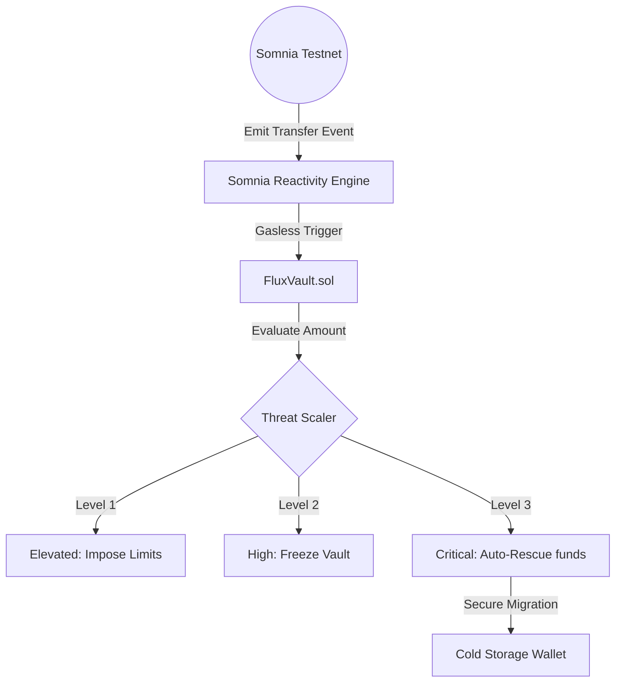

# 🌩️ Somnia Flux: Autonomous Security Firewall

> **Autonomous. Reactive. Gasless.**
> Protecting Total Value Locked (TVL) on the Somnia Shannon Testnet with Real-Time On-Chain Intelligence.

---

## 🛡️ The Problem: The $8B Vulnerability
Smart contract exploits and liquidity drains happen in **milliseconds**. Traditional security relies on manual "Pause" functions or slow multisig responses. By the time an admin reacts, the funds are gone.

## ⚡ The Solution: Somnia Flux
**Somnia Flux** is a Programmable Security Firewall that utilizes **Somnia’s Native On-Chain Reactivity** to detect and neutralize threats the moment they happen—**without human intervention.**

### 💎 Key Innovations
- **Zero-Gas Monitoring**: Leverages the Somnia Reactivity Engine to monitor the entire network for anomaly signals without paying gas for the logic.
- **Atomic Auto-Rescue**: When a critical threat is detected, the vault automatically "Panics" and migrates all assets to a Cold Storage Wallet in the same block.
- **Dynamic Defcon Scaling**: A multi-tiered response system that scales from standard operation to total freezing based on real-time network transfer volume.

---

## 🏗️ Architecture



---

## 🧩 Advanced Security Tiers (Defcon)

| Level | State | Trigger Condition | Automated Response |
| :--- | :--- | :--- | :--- |
| **5** | **NORMAL** | Standard Activity | Full Functionality |
| **4** | **ELEVATED** | Above-threshold transfer | 10% Withdrawal limit enforced |
| **3** | **HIGH** | Sequential large transfers | Vault completely frozen (Paused) |
| **1** | **CRITICAL** | Massive Anomaly detected | **Instant Migration to Cold Storage** |

---

## 🚀 Technical Stack
- **Network**: Somnia Shannon Testnet (Chain ID: 50312)
- **Engine**: Somnia Reactivity Engine (@somnia-chain/streams)
- **Smart Contracts**: Solidity 0.8.28 (OpenZeppelin ReentrancyGuard, Pausable)
- **Frontend**: Vite + React + Framer Motion (Cyberpunk High-Fidelity Design)
- **Web3**: Wagmi + Viem

---

## 🛠️ Installation & Demo

### 1. Prerequisites
- Hardhat
- NPM/Node.js
- Funded Somnia Testnet Wallet (>32 STT)

### 2. Setup
```bash
git clone https://github.com/webhoster45/somnia-flux.git
cd somnia-flux
npm install
```

### 3. Deploy & Register
```bash
# Deploy to Shannon Testnet
node deploy.js

# Register Reactive Subscription (Requires 32 STT)
# Remember to update .env with your VAULT_ADDRESS first!
node subscribe.js
```

### 4. The Live Demo
To see the firepower in action, run the simulation script while watching the dashboard:
```bash
node simulate_attack.js
```
The script will broadcast a massive 260 STT transaction. The Somnia Engine will pick this up instantly, slamming the vault into **DEFCON 1** and rescuing the TVL.

---

## 🌌 Vision
Somnia Flux isn't just a vault; it's a blueprint for the next generation of **Adaptive Cyber-Physical Security** in Web3. We are moving from passive smart contracts to active, sentient defenders.

Built for the **Somnia Reactivity Mini Hackathon**.
